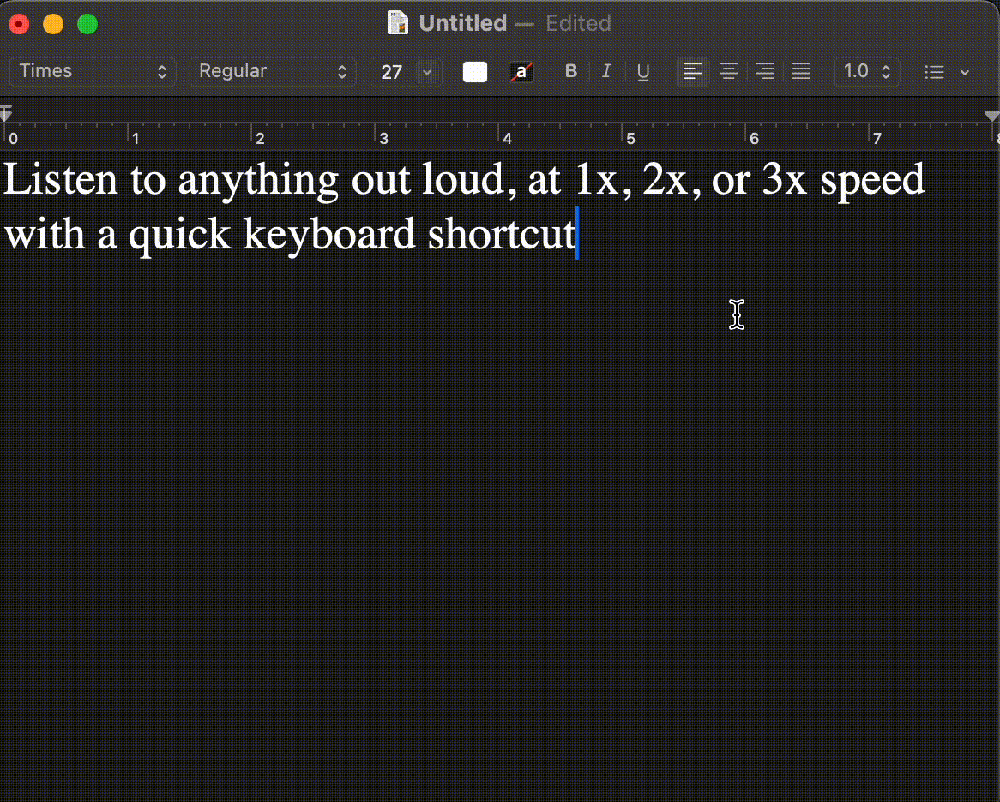

# Speakly

A lightweight floating TTS mini-player for your desktop.



## Install

```bash
pipx install speakly
```

Or with Homebrew:

```bash
brew install noncuro/speakly/speakly
```

## Quick Start

```bash
speakly "Hello, world!"           # uses free edge-tts, no API key needed
speakly                           # reads from clipboard
speakly --file article.txt        # reads from file
speakly --speed 2.0               # set playback speed
```

No API keys, no accounts, no configuration. It just works.

## Features

- **Floating mini-player** -- always-on-top window with play/pause, scrub, speed control (1x-3x), and volume
- **Free out of the box** -- uses edge-tts (Microsoft Edge TTS), no API key required
- **Premium voice upgrades** -- swap in OpenAI, ElevenLabs, or Inworld when you want better quality
- **Smart titles** -- auto-generates a short title for the player window (Claude or GPT if configured, heuristic otherwise)
- **Audio caching** -- SHA256-based cache in `~/.speakly/cache/` with 7-day TTL; repeated text plays instantly
- **Keyboard shortcut support** -- wire up a system hotkey via macOS Shortcuts or Raycast
- **Catppuccin Mocha dark theme** -- easy on the eyes at any hour

## Providers

| Provider | Quality | Speed Control | API Key | Best For |
|----------|---------|---------------|---------|----------|
| edge (default) | Good | Player only | None needed | Getting started, casual use |
| OpenAI | Great | Native 0.25-4x | Required | Speed range, consistent quality |
| ElevenLabs | Excellent | Player only | Required | Multilingual, natural voices |
| Inworld | Excellent | Player only | Required | High-quality at 2-3x speed |

### Recommended: Inworld for fast listening

If you like listening at 2-3x speed, Inworld's TTS 1.5 Max model sounds excellent even sped up. Generation is fast and the audio quality is superb. Getting started takes a minute:

1. Sign up at [inworld.ai](https://inworld.ai)
2. Grab your JWT key and secret from the dashboard
3. Run `speakly config` to save your keys

## Configuration

```bash
speakly config    # interactive setup -- set provider, speed, API keys
```

Config is saved to `~/.speakly/config.toml`. API keys are stored securely in your system keychain via the [keyring](https://pypi.org/project/keyring/) library.

You can also set environment variables directly:

```bash
export OPENAI_API_KEY=sk-...
export ELEVEN_API_KEY=...
export INWORLD_JWT_KEY=...
export INWORLD_JWT_SECRET=...
```

## Usage

```
speakly [OPTIONS] [TEXT]

Options:
  -p, --provider  TTS provider: edge, openai, elevenlabs, inworld   [default: edge]
  -v, --voice     Voice name or ID
  -s, --speed     Playback speed multiplier                         [default: 1.0]
  -f, --file      Read text from a file
  --list-voices   List available voices for the provider
  --help          Show help

Commands:
  config          Open interactive configuration
```

## Keyboard Shortcut (macOS)

Three steps to read any text with a hotkey:

1. Download `Speakly.shortcut` from the [latest release](https://github.com/noncuro/speakly/releases)
2. Double-click to import into Shortcuts
3. Go to System Settings > Keyboard > Keyboard Shortcuts > Services and assign a hotkey (e.g., Cmd+Shift+S)

Then: select text anywhere, copy it (Cmd+C), press your shortcut -- Speakly reads it aloud.

Some apps that support macOS accessibility services (Safari, Notes, TextEdit, VS Code) let the shortcut grab selected text directly, skipping the copy step.

## Performance

Synthesis latency measured on macOS (headless, no UI overhead). The player window itself appears instantly (<150ms) regardless of provider.

| Provider | Text | 1st Audio | Total |
|----------|------|----------:|------:|
| **edge** | short (~200 chars) | — | **0.9s** |
| edge | medium (~900 chars) | — | 1.2s |
| edge | long (~2400 chars) | — | 1.8s |
| elevenlabs | short | — | 1.6s |
| elevenlabs | medium | — | 8.6s |
| elevenlabs | long | — | 20.1s |
| openai | short | — | 4.9s |
| openai | medium | — | 14.0s |
| openai | long | — | 40.0s |
| inworld | short | — | 3.3s |
| inworld | medium | — | 5.3s |
| inworld | long | — | 10.1s |
| **inworld** (progressive) | long | **4.1s** | 8.8s |

Edge is the fastest provider overall. For premium voices on longer texts, Inworld with progressive chunked playback starts audio **60% faster** -- you hear the first chunk in ~4s instead of waiting ~10s for full synthesis.

## How It Works

Text goes to edge-tts (or your chosen provider), comes back as MP3, and gets cached in `~/.speakly/cache/`. The player window appears instantly in a loading state while TTS generates in the background. On a cache hit, playback starts immediately with no waiting.

Long text is automatically chunked and concatenated so there is no input length limit.

## Contributing

```bash
git clone https://github.com/noncuro/speakly.git
cd speakly
uv sync
uv run speakly "test"
```

Fork it, branch it, send a PR. All contributions welcome.

## License

[MIT](LICENSE)
